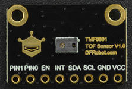
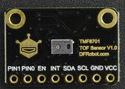

DFRobot_TMF8x01
===========================

* [English Version](./README.md)

TMF8801 是一款 dToF（直接飞行时间）光学距离传感器模块，可实现高达 2500 毫米的目标检测距离。 <br>
TMF8701 是带有相关 VCSEL 的单个模块化封装中的飞行时间 (TOF) 传感器。 TOF设备基于SPAD、TDC和直方图技术。<br>
这两款传感器都支持校准，获取有效14字节准数据的条件如下所述:<br>

1. 40cm范围内没有目标物体；<br>
2. 黑暗条件或弱光照<br>

满足上面2种条件，用calibrtion.ino示例demo获取的校准数据比较正常。<br>





## Product Link（[https://www.dfrobot.com.cn](https://www.dfrobot.com.cn)）
    SKU: SEN0430
    SKU: SEN0429   
   
## Table of Contents

* [概述](#概述)
* [连接](#连接)
* [库安装](#库安装)
* [方法](#方法)
* [兼容性](#兼容性)
* [历史](#历史)
* [创作者](#创作者)

## 概述

它支持TMF8801和TMF8701 TOF测距传感器，这两款传感器特点如下：

 Type | suport ranging mode | ranging ranges | Accuracy |
---------------- | ---------------- | ---------------- | ---------------- |
TMF8801     | PROXIMITY and DISTANCE hybrid mode(only one)  |   20~240cm   | 20~100mm: +/-15mm <br> 100~200mm: +/-10mm |
TMF8701     | PROXIMITY mode |   0~10cm   |   >=200: +/-%5   |
TMF8701     | DISTANCE mode  |  10~60cm   |  100~200mm: +/-10mm |
TMF8701     | PROXIMITY and DISTANCE hybrid mode  |  0~60cm  |

## 连接

  TMF8x01 | MCU |
---------------- | ---------------- |
I2C | 连接到主控的I2C接口 |
EN  | 不连接，浮空或连接到主控的IO引脚上 |
INT | 不连接，浮空或连接到主控的外部中断引脚上 |
PIN0 | 不连接，浮空或连接到主控的IO引脚上，或其他的数字设备，如灯 |
PIN1 | 不连接，浮空或连接到主控的IO引脚上，或其他的数字设备，如灯  |

## 库安装

使用此库前，请首先下载库文件，将其粘贴到\Arduino\libraries目录中，然后打开examples文件夹并在该文件夹中运行演示。

## 方法

```C++
  /**
   * @fn DFRobot_TMF8x01
   * @brief DFRobot_TMF8x01抽象类.
   * @param enPin:  传感器EN引脚连接到主控的数字IO引脚.
   * @param intPin: 传感器INT引脚连接到主控的外部中断引脚.
   * @param pWire : TwoWire类对象. 
   */
  DFRobot_TMF8x01(int enPin, int intPin, TwoWire &pWire);
  ~DFRobot_TMF8x01();

  /**
   * @fn begin
   * @brief 初始化传感器的接口、地址、ram配置去运行APP0应用程序。
   * @return 初始化成功返回0，失败返回-1
   */
  int begin();

  /**
   * @fn sleep
   * @brief 进入睡眠模式，需要调用wakeup去唤醒该传感器。
   */
  void sleep();

  /**
   * @fn wakeup
   * @brief 唤醒传感器，该功能的作用是将传感器从睡眠模式唤醒。
   * @return 唤醒状态：
   * @retval true   唤醒成功
   * @retval false  唤醒失败
   */
  bool wakeup();

  /**
   * @fn getVersion
   * @brief 获取设备版本.
   * @return 以字符串的格式返回设备的版本，格式为：major_minor/patch_hw_serialnum
   */
  String getVersion();

  /**
   * @fn getCalibrationData
   * @brief 获取14字节校准数据。
   * @param data 存储校准数据的缓存。
   * @param len 校准数据的子杰，它的值只能为14字节。
   * @return 校准状态：
   * @retval true 数据有效
   * @retval false 数据无效
   */
  bool getCalibrationData(uint8_t *data, uint8_t len = SENSOR_MTF8x01_CALIBRATION_SIZE);

  /**
   * @fn setCalibrationData
   * @brief 设置14字节校准数据
   * @param data 指向校准数据的指针
   * @param len  校准数据的字节，该值只能被设置为14字节
   * @return 校准状态：
   * @retval true  设置成功
   * @retval false 设置失败
   */
  bool setCalibrationData(uint8_t *data, uint8_t len = SENSOR_MTF8x01_CALIBRATION_SIZE);

  /**
   * @fn stopMeasurement
   * @brief 失能测量， 在使用这个功能前需要调用startMeasurement去启动测量
   */
  void stopMeasurement();

  /**
   * @fn isDataReady
   * @brief 等待数据准备
   * @return 数据准备状态：
   * @retval true  数据准备完成
   * @retval false 数据未准备好
   */
  bool isDataReady();

  /**
   * @fn getDistance_mm
   * @brief 获取测量距离，单位: mm. 在使用这个功能之前，你需要调用isDataReady函数，去判断数据是否准备好，才能读到有效数据。
   * @return 距离值, 单位 mm.
   */
  uint16_t getDistance_mm();

  /**
   * @fn enableIntPin
   * @brief 使能INT引脚， 如果你使能了该功能，则当测量数据准备完成时会在INT引脚产生一个中断信号。
   */
  void enableIntPin();

  /**
   * @fn disableIntPin
   * @brief 使能INT中断引脚功能.
   */
  void disableIntPin();

  /**
   * @fn powerOn
   * @brief 通过EN引脚开启传感器。
   * @return 状态
   * @retval true  开启成功
   * @retval false 开启失败
   */
  bool powerOn();

  /**
   * @fn powerDown
   * @brief 通过EN引脚关掉传感器
   * @return sucess return True, or return False
   */
  bool powerDown();

  /**
   * @fn getI2CAddress
   * @brief 获取I2C地址
   * @return 返回7位I2C地址
   */
  uint8_t getI2CAddress();

  /**
   * @fn pinConfig
   * @brief 配置传感器的引脚。
   * @param pin: 传感器的引脚，例： PIN0和PIN1，分别对应ePin_t枚举变量的ePIN0和ePIN1，解释如下：
   * @n     ePIN0:  传感器的PIN0引脚.
   * @n     ePIN1:  传感器的PIN1引脚.
   * @n     eGPIOTotal:  传感器的PIN0和PIN1引脚.
   * @param config:  pin的配置，是ePinControl_t的一个枚举变量。
   * @n     ePinInputLow    输入低电平
   * @n     ePinInputHigh   输入高电平
   * @n     ePinOutputVCSEL 输出VCSEL信号
   * @n     ePinOutputLow   输出低电平
   * @n     ePinOutputHigh  输出高电平
   */
  void pinConfig(ePin_t pin, ePinControl_t config);

  /**
   * @fn getJunctionTemperature_C
   * @brief 获取传感器的结温，结温即传感器的实际工作温度，在操作中，它通常较封装外壳温度高。
   * @return 结温, 单位, ℃.
   */
  int8_t getJunctionTemperature_C();

  /**
   * @fn startMeasurement
   * @brief 配置测量参数去使能测量。调用stopMeasurement函数将停止测量动作
   * @param cailbMode: eCalibModeConfig_t 的一个枚举变量，用于配置测量校准模式。
   * @n     eModeNoCalib  :          测量时无校准.
   * @n     eModeCalib    :          测量时有校准.
   * @n     eModeCalibAndAlgoState : 使用校准和算法状态进行测量.
   * @return 测量启动状态:
   * @retval      false  启用测量失败。
   * @retval      true   启用测量成功。
   */
  bool startMeasurement(eCalibModeConfig_t cailbMode = eModeCalib);

  /**
   * @fn startMeasurement
   * @brief  配置测量参数去使能测量。调用stopMeasurement函数将停止测量动作
   * @param cailbMode: eCalibModeConfig_t 的一个枚举变量，用于配置测量校准模式。
   * @n     eModeNoCalib  :          测量时无校准.
   * @n     eModeCalib    :          测量时有校准.
   * @n     eModeCalibAndAlgoState : 使用校准和算法状态进行测量.
   * @param disMode : TMF8701传感器的测距模式。
   * @n     ePROXIMITY: PROXIMITY接近模式下测量，测量范围0~10cm.
   * @n     eDISTANCE:  距离模式下测量，范围10~60cm。Raing in distance mode,ranging range 10~60cm
   * @n     eCOMBINE:   接近和距离模式下测量，范围0~60cm
   * @return 测量启动状态:
   * @retval      false  启用测量失败。
   * @retval      true   启用测量成功。
   */
  bool startMeasurement(eCalibModeConfig_t cailbMode = eModeCalib, eDistaceMode_t disMode = eCOMBINE);
```

## 兼容性

MCU                | Work Well    | Work Wrong   | Untested    | Remarks
------------------ | :----------: | :----------: | :---------: | -----
Arduino Uno        |      √       |              |             | 
Mega2560           |      √       |              |             | 
Leonardo           |      X       |              |             | 
ESP32              |      √       |              |             | 
micro:bit          |      √       |              |             | 
FireBeetle M0      |      √       |              |             |
raspberry          |      √       |              |             | 

## 历史

- 2021/04/06 - 1.0.0 版本

## 创作者

Written by Arya(xue.peng@dfrobot.com), 2021. (Welcome to our [website](https://www.dfrobot.com/))


