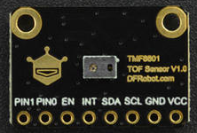
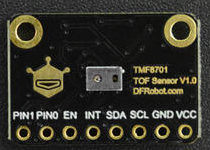

# DFRobot_TMF8x01

* [English Version](./README.md)

TMF8801 是一款 dToF（直接飞行时间）光学距离传感器模块，可实现高达 2500 毫米的目标检测距离。 <br>
TMF8701 是带有相关 VCSEL 的单个模块化封装中的飞行时间 (TOF) 传感器。 TOF设备基于SPAD、TDC和直方图技术。<br>
这两款传感器都支持校准，获取有效14字节准数据的条件如下所述:<br>

1. 40cm范围内没有目标物体；<br>
2. 黑暗条件或弱光照；<br>

满足上面2种条件，用calibrtion.ino示例demo获取的校准数据比较正常。<br>




## 产品链接（[https://www.dfrobot.com.cn](https://www.dfrobot.com.cn)）
    SKU: SEN0430
    SKU: SEN0429

## 目录

  * [概述](#概述)
  * [连接](#连接)
  * [库安装](#库安装)
  * [方法](#方法)
  * [兼容性](#兼容性)
  * [历史](#历史)
  * [创作者](#创作者)

## 概述

它支持TMF8801和TMF8701 TOF测距传感器，这两款传感器特点如下：

 Type | suport ranging mode | ranging ranges | Accuracy |
---------------- | ---------------- | ---------------- | ---------------- |
TMF8801     | PROXIMITY and DISTANCE hybrid mode(only one)  |   20~240cm   | 20~100mm: +/-15mm <br> 100~200mm: +/-10mm |
TMF8701     | PROXIMITY mode |   0~10cm   |   >=200: +/-%5   |
TMF8701     | DISTANCE mode  |  10~60cm   |  100~200mm: +/-10mm |
TMF8701     | PROXIMITY and DISTANCE hybrid mode  |  0~60cm  |

## 连接

  TMF8x01 | 树莓派 |
---------------- | ---------------- |
I2C | 连接到树莓派的I2C接口 |
EN  | 不连接，浮空或连接到树莓派的IO引脚上 |
INT | 不连接，浮空或连接到树莓派的外部中断引脚上 |
PIN0 | 不连接，浮空或连接到树莓派的IO引脚上，或其他的数字设备，如灯 |
PIN1 | 不连接，浮空或连接到树莓派的IO引脚上，或其他的数字设备，如灯  |

## 库安装

1. 下载库至树莓派，要使用这个库，首先要将库下载到Raspberry Pi，命令下载方法如下:<br>
```python
sudo git clone https://github.com/DFRobot/DFRobot_TMF8x01
```
2. 打开并运行例程，要执行一个例程demo_x.py，请在命令行中输入python demo_x.py。例如，要执行demo_calibration.py例程，你需要输入:<br>

```python
python demo_calibration.py 
或 
python2 demo_calibration.py 
或 
python3 demo_calibration.py
```

## 方法

```python
  '''！
    @brief 配置测量参数去使能测量。调用stop_measurement函数将停止测量动作
    @param calib_m: 枚举变量，用于配置测量校准模式。
    @n     eMODE_NO_CALIB  :           测量时无校准.
    @n     eMODE_CALIB    :            测量时有校准.
    @n     eMODE_CALIB_AND_ALGOSTATE : 使用校准和算法状态进行测量.
    @return 测量启动状态:
    @retval      False:  启用测量失败。
    @retval      True:   启用测量成功。
  '''
  def start_measurement(self, calib_m):

  '''
    @brief 配置测量参数去使能测量。调用stop_measurement函数将停止测量动作
    @param calib_m: 一个枚举变量，用于配置测量校准模式。
    @n     eMODE_NO_CALIB  :           测量时无校准.
    @n     eMODE_CALIB    :            测量时有校准.
    @n     eMODE_CALIB_AND_ALGOSTATE : 使用校准和算法状态进行测量.
    @param mode : TMF8701传感器的测距模式。
    @n     ePROXIMITY: PROXIMITY接近模式下测量，测量范围0~10cm.
    @n     eDISTANCE: 距离模式下测量，范围10~60cm。Raing in distance mode,ranging range 10~60cm
    @n     eCOMBINE:   接近和距离模式下测量，范围0~60cm
    @return 测量启动状态:
    @retval      False:  启用测量失败。
    @retval      True:   启用测量成功。
  '''
  def start_measurement(self, calib_m, mode):
    
  '''!
    @brief    初始化传感器的接口、地址、ram配置去运行APP0应用程序。
    @return   错误代码
  '''
  def begin(self):

  '''!
    @brief  进入睡眠模式，需要调用wakeup去唤醒该传感器。
  '''
  def sleep(self):
  
  '''!
    @brief  唤醒传感器，该功能的作用是将传感器从睡眠模式唤醒。
  '''
  def wakeup(self):
    
  '''!
    @brief 获取唯一编号的传感器。每个传感器都有唯一的标识符。
    @return 返回 4bytes 唯一编号:
    @n  第1字节: 序列号0，serial_number_0
    @n  第2字节: 序列号1，serial_number_1
    @n  第3字节: 标识符1，identification_number_1
    @n  第4字节: 标识符0， identification_number_0
  '''
  def get_unique_id(self): 

  '''!
    @brief 获取传感器型号。
    @return 返回字符串:
    @n  TMF8801: 传感器是TMF8801
    @n  TMF8701: 传感器是TMF8701
    @n  unknown : 不知道的设备
  '''
  def get_sensor_model(self): 

  '''!
    @brief 获取补丁的软件版本号 
    @return 软件版本字符串，格式：major.minor.patch numbers.chip id version
  '''
  def get_software_version(self): 

  '''!
    @brief  获取14字节校准数据。
    @return 返回14字节校准数据
  '''
  def get_calibration_data(self): 
    
  '''!
    @brief  设置14字节校准数据.
    @param l 14字节校准数据列表.
    @return 设置状态
    @retval True 设置成功.
    @retval False 设置失败
  '''
  def set_calibration_data(self, l): 

  '''!
    @brief  停止测量.
  '''  
  def stop_measurement(self):

  '''!
    @brief  等待测量数据准备.
    @return 如果数据未准备好，返回True，否则返回失败
  '''
  def is_data_ready(self):
    
  '''!
    @brief  获取测量距离，单位: mm. 在使用这个功能之前，你需要调用is_data_ready函数，去判断数据是否准备好，才能读到有效数据。 
    @return 距离值, 单位 mm.
  '''  
  def get_distance_mm(self):

  '''!
    @brief  使能INT引脚， 如果你使能了该功能，则当测量数据准备完成时会在INT引脚产生一个中断信号。
  '''
  def enable_int_pin(self):

  '''!
    @brief 使能INT中断引脚功能.
  '''
  def disable_int_pin(self):

  '''!
    @brief 通过EN引脚开启传感器。
    @return 成功返回 True, 失败返回False
  '''
  def power_on(self):
    
  '''!
    @brief 通过EN引脚关掉传感器
    @return 成功返回 True, 失败返回False
  '''
  def power_down(self):
  
  '''!
    @brief 获取I2C地址.
    @return 返回7位I2C地址
  '''
  def get_i2c_address(self):

  '''!
    @brief 获取传感器的结温，结温即传感器的实际工作温度，在操作中，它通常较封装外壳温度高。
    @return 结温, 单位, ℃.
  '''
  def get_junction_temperature_C(self):
```

## 兼容性

| 主板         | 通过 | 未通过 | 未测试 | 备注 |
| ------------ | :--: | :----: | :----: | :--: |
| RaspberryPi2 |      |        |   √    |      |
| RaspberryPi3 |      |        |   √    |      |
| RaspberryPi4 |  √   |        |        |      |

* Python 版本

| Python  | 通过 | 未通过 | 未测试 | 备注 |
| ------- | :--: | :----: | :----: | ---- |
| Python2 |  √   |        |        |      |
| Python3 |  √   |        |        |      |

## 历史

- 2021/04/06 - 1.0.0 版本

## 创作者

Written by Arya(xue.peng@dfrobot.com), 2021. (Welcome to our [website](https://www.dfrobot.com/))


